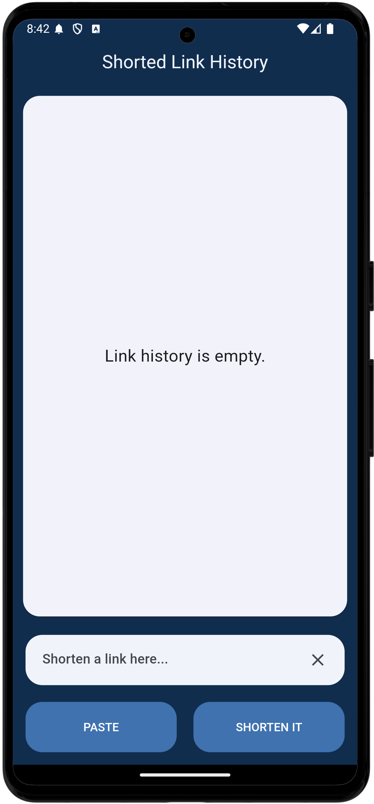
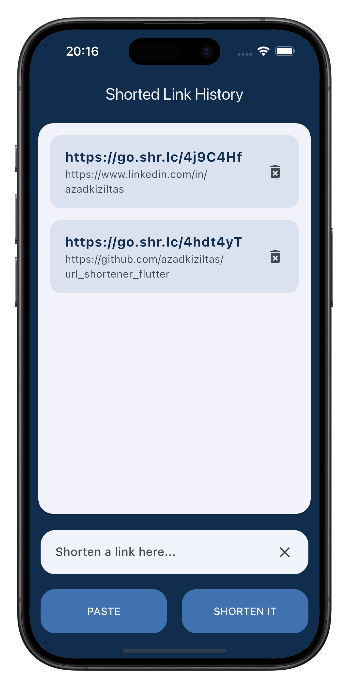

# URL Shortener Application

The URL Shortener is a simple and intuitive mobile application designed for Android and iOS platforms. It allows users to shorten lengthy URLs efficiently and save them locally for future reference. The app offers a clean UI, making the process of URL shortening seamless.

## Features
- Shorten long URLs with ease.
- Save shortened URLs locally using `shared_preferences`.
- View a list of all previously shortened URLs.
- Cross-platform support for both Android and iOS.
- Toast notifications for user feedback.

## Architecture
The app is built using the **BLoC (Business Logic Component)** architecture pattern. This ensures a clear separation of concerns, making the app scalable and maintainable.

- **Business Logic**: Handles the application's core functionality and logic.
- **UI Layer**: Displays the user interface and handles user interactions.
- **Data Layer**: Manages data storage and retrieval using `shared_preferences` and network requests via `dio`.

## Technologies and Libraries Used

- **Flutter**: Framework for cross-platform development.
- **BLoC**: State management library for predictable state transitions.
- **Dio**: HTTP client for making network requests.
- **Shared Preferences**: Persistent local storage for saving shortened URLs.
- **Flutter Toast**: Displaying toast messages for user feedback.
- **Flutter Launcher Icons**: Custom app icons for Android and iOS.

## Screenshots

| Android Version            | iOS Version               | Gif               |
|----------------------------|---------------------------|---------------------------|
|  |  |  |

## Setup

1. Clone this repository:
    ```bash
    git clone https://github.com/azadkiziltas/url_shortener_flutter.git
    ```
2. Navigate to the project directory:
    ```bash
    cd url_shortener_flutter
    ```
3. Install dependencies:
    ```bash
    flutter pub get
    ```
4. Run the application on your device:
    ```bash
    flutter run
    ```

## License

This project is licensed under the MIT License. See the [LICENSE](LICENSE) file for more details.

---

Feel free to contribute, report issues, or share feedback by opening an issue or contacting me. Happy coding!
